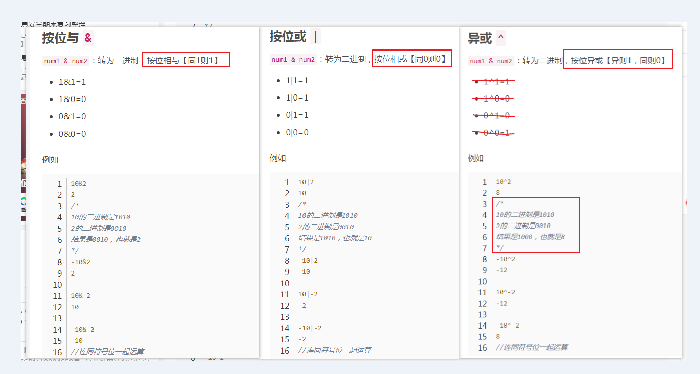
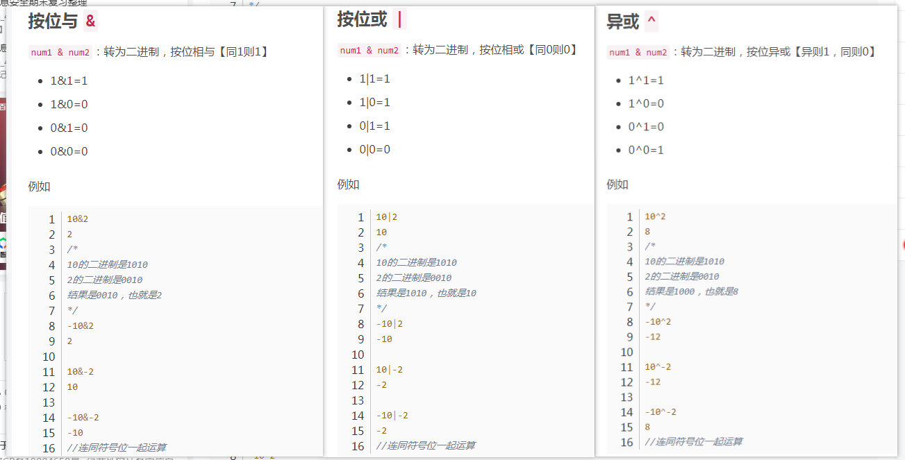

<!--
 * @Description: 
 * @Author: wangqi
 * @Date: 2019-12-14 17:55:42
 * @LastEditTime : 2020-01-04 14:12:34
 -->
 
<h3>字符串 simple</h3>




>**二进制运算**
```

```
***


>**分割线**
```
分割线使用 ***
```
***

>**无序， 加粗**
```
* 1
* 2
* 3

加粗 =>  **加粗** || <Strong>加粗</Strong> 

<em>斜体</em>

~~待删除~~
```
***

>**表格**
```
表格使用 ***
:-:     center
:-      left
-:      right
```
***
| name  | age  |  sex |
| :---: | :--- | ---: |
| 张三  | 12   |    0 |
| 张三  | 12   |    0 |
| 张三  | 12   |    0 |
| 张三  | 12   |    0 |


